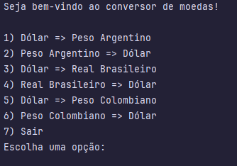

<h1 align="center"> Conversor de Moedas </h1>

[](https://wakatime.com/badge/github/Daaaiii/conversor-de-moedas)

## Estatísticas do Projeto
Verifique as estatísticas do projeto no link abaixo:

[Estatísticas do Projeto](https://wakatime.com/@Daaaiii/projects/ijtjnsnpos?start=2024-05-14&end=2024-05-14)

## Descrição do projeto

<p align="justify">
  Projeto desenvolvido para o Desafio de Projeto do Curso de Java da ONE em parceria com a Alura, com o objetivo de criar um conversor de moedas.


## Funcionalidades do projeto

- `Funcionalidade 1`: O programa é um conversor de moedas que converte o valor de uma moeda para outra moeda com base na escolha feita pelo usuário.




## Clonando o projeto

1 - Clone o projeto:

```bash
git clone https://github.com/Daaaiii/conversor-de-moedas.git
```

## Stay in touch

<table>
  <tr>
    <td align="center">
      <a href="https://www.linkedin.com/in/daiane-deponti-bolzan/">
        <br>
        <sub>
          <b>Daiane Bolzan</b>
        </sub>
      </a>
    </td>
  </tr>
</table>

## Licença

Este projeto está sob a licença MIT. Veja o arquivo [LICENSE](LICENSE.md) para mais detalhes.